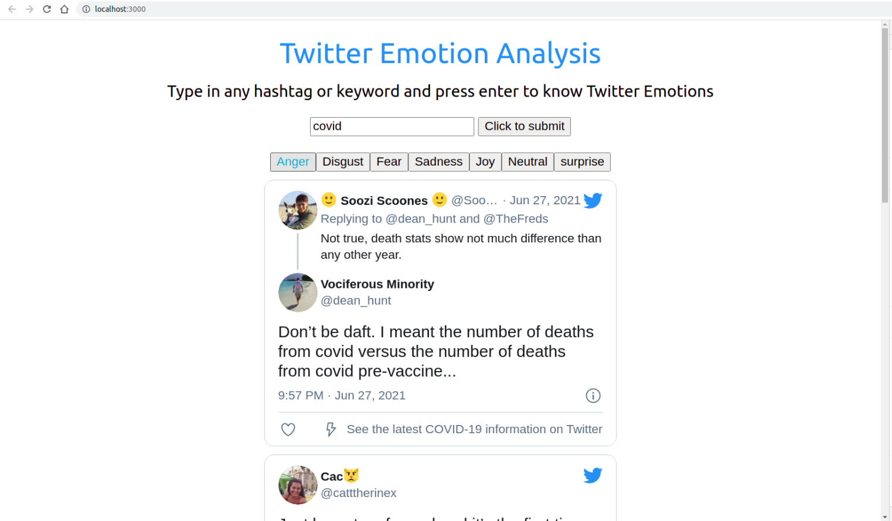
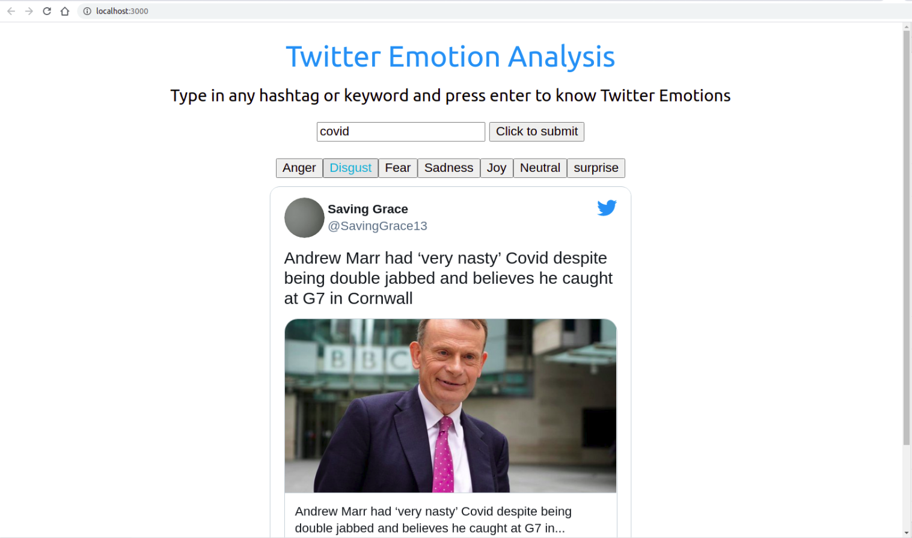
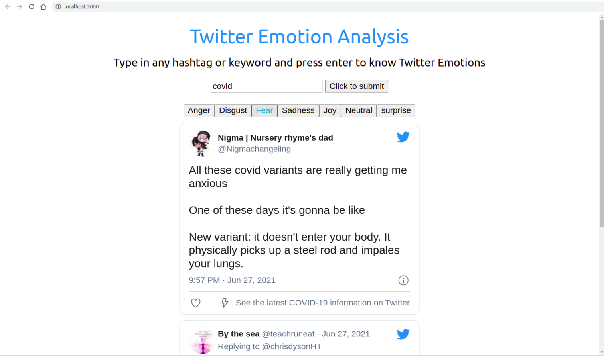
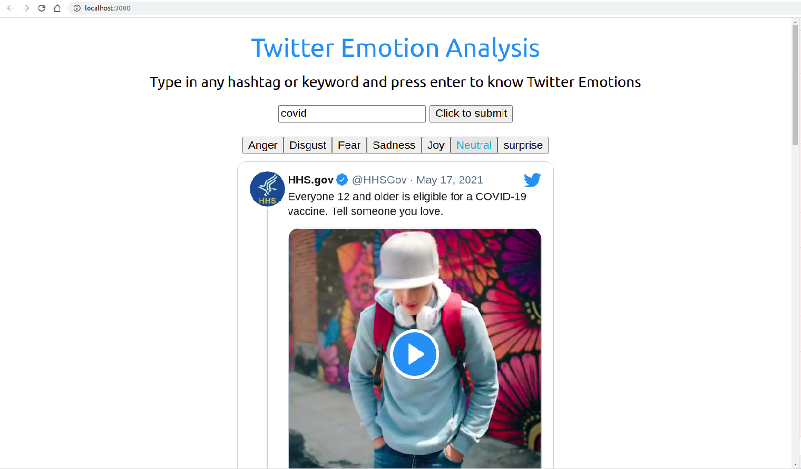

## This repository contains the frontend for Twitter Emotion Analysis. 

A user can input any keyword or a hashtag and the tweets related to the keyword would be displayed under one of the seven emotion category i.e. anger, disgust, fear, sadness, joy, neutral and surprise.

## Demo 






## To run the frontend :-

First enter the repository after cloning it. Then run the following commands :- 

```
npm install 
npm start
```

To fetch tweets along with their emotions, Backend Api repository link is https://github.com/msknkh/twitter-emotion-backend along with the commands to run the repository. 